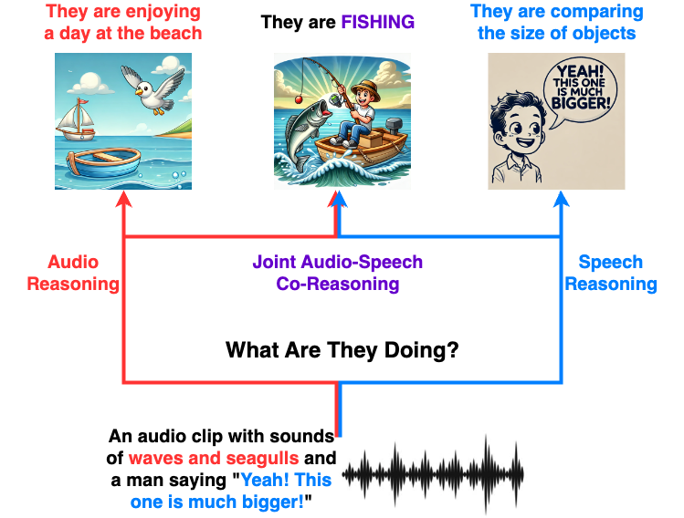
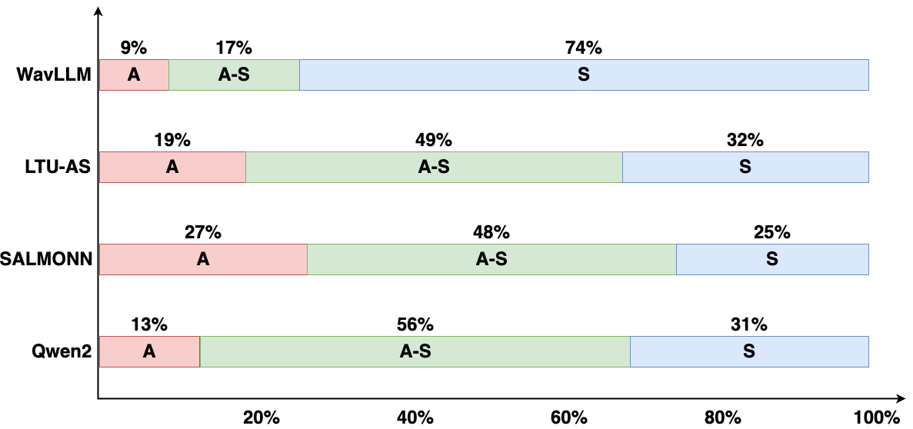

<p align="center" width="100%">

</p>


# Joint Audio-Speech Co-Reasoning (JASCO)

[](https://https://github.com/BenoitWang/What_Are_They_Doing/blob/main/LICENSE)
[](https://https://github.com/BenoitWang/What_Are_They_Doing/blob/main/DATA_LICENSE)

This repo contains a benchmark of popular Auditory Large Language Models (ALLMs) on the [Joint Audio-Speech Co-Reasoning (JASCO)] task, which is a joint audio-speech task that requires a strict co-reasoning based on both audio and speech.

## What Are They Doing dataset
The What Are They Doing dataset is an open-ended scene reasoning question-answering dataset, where the models need to understand both audio and speech and reason what the speakeres are possibly doing. It contains 80 carefully-designed audio clips and QA pairs. The main features of the dataset are:
1. Both sound and human speech are present in the same audio clip.
2. The correct answer is based on both audio and speech, using one single modality leads to Audio-Oriented or Speech-Oriented Answer.
3. The correct answer requires a deep reasoning rather than a concatenation of information.
4. The audio information and speech information are irrelevant.

The dataset can be found in the `dataset` folder with the designed answers in the csv file. 

Listen to the audio clips and make a guess yourself before checking the answers 😆.

## Inference with ALLMs
For each sample, we give the model 8 different instructions and switch the position of "audio" and "speech" in the instruction.
```
Based on both the audio sound and the spoken text, infer what the speakers are doing specifically?
Based on both the spoken text and the audio sound, infer what the speakers are doing specifically?

What is the spoken text? What is the audio sound? Based on both the spoken text and the audio sound, infer what the speakers are doing specifically?
What is the audio sound? What is the spoken text? Based on both the audio sound and the spoken text, infer what the speakers are doing specifically?

What is the spoken text? What is the audio sound? Based on both the spoken text and the audio sound, infer what specific scenario are the speakers in?
What is the audio sound? What is the spoken text? Based on both the audio sound and the spoken text, infer what specific scenario are the speakers in?

What sound can you hear? What does the speaker say? Guess what activity the speakers are engaged in using both the audio sound and the spoken text.
What does the speaker say? What sound can you hear? Guess what activity the speakers are engaged in using both the spoken text and the audio sound.
```

We refered to the following inference code provided in each repo:

LTU-AS: https://github.com/YuanGongND/ltu?tab=readme-ov-file#option-2-inference-with-api-no-gpu-needed

SALMONN: https://huggingface.co/tsinghua-ee/SALMONN-7B#how-to-inference-in-cli

QWEN2: https://huggingface.co/Qwen/Qwen2-Audio-7B-Instruct#audio-analysis-inference

WavLLM: https://github.com/microsoft/SpeechT5/tree/main/WavLLM#inference

## Evaluation
We use the Model-As-Judge approach to evaluate the models' capabilities on the JASCO task. We instruct the model judge to conduct 2 evaluations by giving a designed prompt:
```
[Audio Sound]
{audio_sound}

[Spoken Text]
{spoken_text}

[Question]
{question}

[Audio-Oriented Prediction]
{audio_only_target}

[Speech-Oriented Prediction]
{speech_only_target}

[Reference Answer]
{reference}

[Reference Answer Key Words]
{keywords}

[Model Prediction]
{prediction}

[Task1]
I am using a model to predict what the speakers are possibly doing based on both the audio sound and the spoken text. I want you to help me rate a score for the model's prediction on the speaker's action given a list of information [Audio Sound, Spoken Text, Question, Reference Answer, Reference Answer Key Words, Model Prediction]
Criteria: Assess if the model’s prediction of the speaker's action mirrors the speaker's action in the reference answer in terms of content, logic, and relevance. Also assess if the model's prediction contains the Reference Answer Key Words or similar meanings. Do not care about the verb tense or other useless details in the model's response, focus only on the parts that speaker's actions are mentionned and the keywords. Very important: if the response mentions only the audio sound and the spoken text but not create a prediction of the speaker's specific action, rate it direcly 0, an exemple prediction like this can be 'The audio clip contains the sound of [some sounds]. The speaker says [some spoken texts]''.
Score0: The speaker's action predicted is completely misaligned, providing incorrect or irrelevant information compared to the speaker's action in the reference or the inference from audio sound and spoken text is not logical or based on only one modality (audio or speech), or the reponse is too general such as 'talking to someone' or 'having conversation'
Score1: The speaker's action predicted aligns with the speaker's action in the reference generally but lacks detailed keywords, the predicted action is based on both audio sound and spoken text and is logical enough but not the most possible.
Score2: The speaker's action predicted is highly accurate, and matches the speaker's action in the reference perfectly, capturing its essence and detailed keywords. The prediction is derived from both audio sound and spoken text and is very logical and the most probable.

[Task2]
Evaluate if the model's prediction of the speaker's action is inferred from audio sound or from spoken text or from both. You need to follow the below steps:
1. The model's response may contain multiple information, an example is 'The audio clip contains the sound of [detected audio sound], the speaker says [transcribed spoken text], this suggest that they are [predicted speaker's action]'. You need to first extract different components from the model's response: Part1-audio sound detected(may not exist), Part2-spoken text transcribed (may not exist), and Part3-speaker's action predicted(may not exist). If the predicted speaker's action does not exist, the result is directly 'Neither'.
2. If Part3 exists, align it with Part1 and Part2. Compare the alignments and choose an orientation of the prediction of the speaker's action:
Audio-Oriented: The predicted speaker's action is explicitly and strongly related to the audio sound.
Speech-Oriented: The predicted speaker's action is explicitly and strongly related to the spoken text or they have a significant overlap. 
Both: The predicted speaker's action is explicitly and strongly related to both the audio sound and the spoken text. Important: if Part3 contains general terms lile 'activity' or 'activity related to' or 'something' or 'somewhere', and you can't choose 'Both' and must choose between 'Audio-Oriented' and 'Speech-Oriented'.
Remember only to use the extracted predicted speaker's action for assessment make sure you see a STRONG correlation when you make decisions.

Your response should be formatted as follows:
Explanation1: (Provide a concise explanation of your rating, comparing the reference answer with the model’s response. 'The provided audio sound is [BBB], the provided spoken text is [CCC], the reference answer is [XXX], the reference keywords are [KKK], while the model’s answer is [YYY]. I think ...')
Rating: (int)
Explanation2: (Provide a concise explanation of your choice among Audio-Oriented/Speech-Oriented/Both/Neither, remember to focus on the texts you see and don't imagine too much. 'The provided audio sound is [BBB] and the provided spoken text is [CCC]. The detected audio sound in the model's reponse is [PPP]. The transcribed spoken text in the model's reponse is [QQQ]. The predicted speaker's action in the model's reponse is [YYY], I think ...')
Orientation: Audio-Oriented/Speech-Oriented/Both/Neither
```

Here we also show some outputs from Llama-3.1-70B-Instruct-as-judge:
```
######################### Rating 0 + Audio-Oriented #########################
Explanation1: The provided audio sound is joyful laughter and shouting, the provided spoken text is a message about children being accompanied by an adult at all times, the reference answer is that they are likely at a recreational facility or amusement park, the reference keywords are 'amusement park', while the model’s answer is 'They are laughing'. I think the model's prediction of the speaker's action is not aligned with the reference answer, as it only mentions the emotional state of the speakers but does not capture the specific action or setting.

Rating: 0

Explanation2: The provided audio sound is joyful laughter and shouting and the provided spoken text is a message about children being accompanied by an adult at all times. The model's response does not explicitly transcribe or detect the audio sound or the spoken text. The predicted speaker's action in the model's response is 'They are laughing', I think this prediction is Audio-Oriented, since 'laughing' directly correlates with the joyful laughter in the audio sound but does not relate to the spoken text about announcements or instructions in a public place.

Orientation: Audio-Oriented

######################### Rating 0 + Speech-Oriented #########################
Explanation1: The provided audio sound is birds chirping and a gentle breeze, the provided spoken text is "What's in your basket?", the reference answer is "They are likely having a picnic", the reference keywords are "picnic", while the model's answer is "It is likely that the speaker is asking someone to show them their shopping bag or basket". I think the model’s prediction does not capture the essence of the speaker's action as it misinterprets the context, and doesn't include the reference keyword "picnic" and is only logical for the spoken text but fails to connect with the audio sound for the action. 

Rating: 0

Explanation2: The provided audio sound is birds chirping and a gentle breeze and the provided spoken text is "What's in your basket?". The detected audio sound in the model's response is "The background sounds of birds chirping suggest that they might be outside, possibly in a park or garden", and the transcribed spoken text in the model's response is "The speaker says 'What's in your basket?'". The predicted speaker's action in the model's response is "It is likely that the speaker is asking someone to show them their shopping bag or basket". However, I think the predicted speaker's action has a relation with the spoken text but it actually fails to maintain an explicit and strong relation with the detected audio sound "birds chirping" since it could happen in many unrelated activities so I should rate it 'Speech-Oriented'.

Orientation: Speech-Oriented

######################### Rating 1 + Both-Oriented #########################
Explanation1: 
The provided audio sound is waves crashing and seagulls, the provided spoken text is "Let's build a castle over there", the reference answer is they are planning to build a sandcastle, the reference keywords are sandcastle, while the model’s answer is it can be inferred that the speaker wants to build a castle near the ocean or beach. I think the model's answer is somewhat relevant but lacks the specific detail of building with sand, though generally aligns with the reference. 

Rating: 1

Explanation2: 
The provided audio sound is waves crashing and seagulls and the provided spoken text is "Let's build a castle over there". The detected audio sound in the model's response is waves crashing, the transcribed spoken text in the model's response is "Let's build a castle over there", The predicted speaker's action in the model's response is building a castle near the ocean or beach, I think it is strongly related to both the audio sound and the spoken text so it can be classified as Both.

Orientation: Both

######################### Rating 2 + Both-Oriented #########################
Explanation1: 
The provided audio sound is rock music, the provided spoken text is "Let's run through it one more time", the reference answer is "they are likely practicing a song in a band rehearsal", the reference keywords are "band rehearsal", while the model's answer is "practicing or rehearsing a guitar part in a musical context, possibly with other musicians or alone". I think the model's prediction closely matches the reference answer in terms of content and logic, and it contains similar meanings of the Reference Answer Key Words "band rehearsal" (using musical context, possibly with other musicians), but it doesn't use the exact reference key words. However, it accurately infers the speaker's action from both audio sound and spoken text.

Rating: 2

Explanation2: 
The provided audio sound is rock music and the provided spoken text is "Let's run through it one more time". The predicted speaker's action in the model's response is "practicing or rehearsing a guitar part in a musical context, possibly with other musicians or alone". I think this speaker's action is explicitly and strongly related to both the audio sound (rock music) and the spoken text ("Let's run through it one more time"), which suggests a rehearsal process in a musical context.

Orientation: Both
```

To run the evaluation code, first install the dependencies
```
pip install -r requirements.txt
```
Please first do inference yourself for your own ALLM and organize your outputs within a csv file such as `/evaluation/example.csv`, then run the evaluation:
```
cd evaluation/
python eval.py {model_id} {input_file} {output_path}
# python eval.py meta-llama/Meta-Llama-3.1-70B-Instruct example.csv llama3.1_70B.csv
```


## Benchmark Results
1. Model judge best-mean:

| model | best-mean |
|:---------------------------:|:-----------:|
| WavLLM-7B | 0.49 |
| LTU-AS-7B | 1.04 |
| SALMONN-7B | 1.21 |
| Qwen2-Audio-Instruct-7B | 1.38 |

2. Modality-Dependence

| model | Audio-Dependence% | Both-Dependence% | Speech-Dependence% |
|:---------------------------:|:-------------------:|:-------------------:|:-------------------:|
| WavLLM-7B | 9 | 17 | 74 |
| LTU-AS-7B | 19 | 49 | 32 |
| SALMONN-7B | 27 | 48 | 25 |
| Qwen2-Audio-Instruct-7B | 13 | 56 | 31 |



## **Cite Joint Audio-Speech Co-Reasoning and What Are They Doing dataset**

<!-- ```bibtex
@article{wang2023speech,
  title={Speech Emotion Diarization: Which Emotion Appears When?},
  author={Wang, Yingzhi and Ravanelli, Mirco and Nfissi, Alaa and Yacoubi, Alya},
  journal={arXiv preprint arXiv:2306.12991},
  year={2023}
}
``` -->